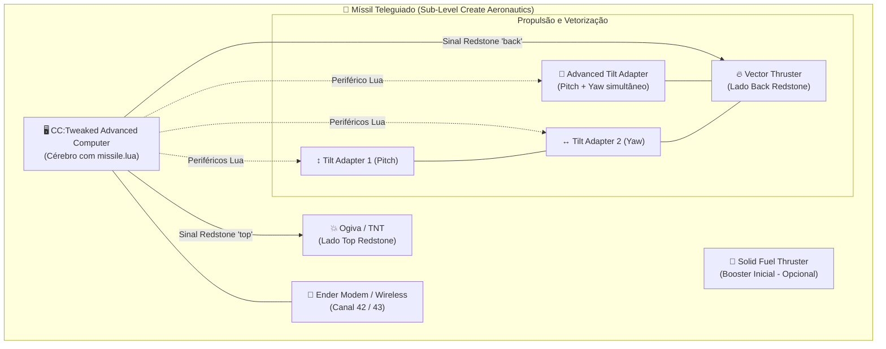

# 🔧 Guia de Montagem - Míssil Teleguiado

Guia passo-a-passo para construir o míssil e a estação de controle no Minecraft.

---

## 🚀 Parte 1: Construindo o Míssil

### Materiais Necessários

| Quantidade | Item | Mod |
|------------|------|-----|
| 1x | Advanced Computer | CC:Tweaked |
| 1x | Ender Modem (ou Wireless Modem) | CC:Tweaked |
| 1x ou 2x | Vector Thruster | Create Propulsion |
| 1x | **Advanced Tilt Adapter** (ou 2x Tilt Adapter Normal) | Create Propulsion |
| 1x | Solid Fuel Thruster (opcional, booster) | Create Propulsion |
| 1x | Physics Assembler | Create Simulated |
| ~20x | Blocos de estrutura (ferro, cobre, etc.) | Vanilla/Create |
| 1x | TNT ou Shell explosiva (opcional, ogiva) | Vanilla/CBC |
| 1x | Honey Glue (opcional, para manter junto) | Create Simulated |

### Diagrama de Arquitetura do Míssil (Mermaid)



---

### Esquema Visual de Bloco a Bloco (ASCII)

#### 📌 Opção 1: Montagem com Advanced Tilt Adapter (Recomendado)

```text
       [ TETO / FRENTE DO MÍSSIL ]
                 |
         +---------------+
         |   💥 OGIVA    |  ← TNT / Explosivo (Conectado ao topo do computador)
         +---------------+
                 | (Lado TOP - Redstone para detonar)
         +---------------+
         |  🖥️ COMPUTER  |  ← CC:Tweaked Advanced Computer (roda missile.lua)
         |  📡 [MODEM]   |  ← Ender Modem em uma das laterais (Luz vermelha ACESA)
         +---------------+
                 | (Lado BACK - Redstone para acelerador)
         +---------------+
         | 🔄 ADVANCED   |  ← Advanced Tilt Adapter (Controla Pitch e Yaw)
         |  TILT ADAPTER |
         +---------------+
                 |
         +---------------+
         | 🔥 VECTOR     |  ← Vector Thruster (Aparato de exaustão apontado para trás)
         |   THRUSTER    |
         +---------------+
                 |
       [ FOGO / SAÍDA DE EXAUSTÃO ]
```

---

#### 📌 Opção 2: Montagem com 2 Tilt Adapters Normais

```text
       [ TETO / FRENTE DO MÍSSIL ]
                 |
         +---------------+
         |   💥 OGIVA    |  ← TNT / Carga Explosiva
         +---------------+
                 | (Lado TOP Redstone)
         +---------------+
         |  🖥️ COMPUTER  |  ← CC:Tweaked Advanced Computer
         |  📡 [MODEM]   |  ← Ender Modem ativo
         +---------------+
                 | (Lado BACK Redstone)
         +---------------+
         | ↕️ TILT 1     |  ← Tilt Adapter Normal (Configurado/Alocado para PITCH)
         +---------------+
                 |
         +---------------+
         | ↔️ TILT 2     |  ← Tilt Adapter Normal (Configurado/Alocado para YAW)
         +---------------+
                 |
         +---------------+
         | 🔥 VECTOR     |  ← Vector Thruster
         |   THRUSTER    |
         +---------------+
                 |
       [ FOGO / SAÍDA DE EXAUSTÃO ]
```

---

#### 📌 Esquema de Montagem da Estação de Controle (HUD)

```text
   +-------------------------------------------------------+
   |             PAINEL DE MONITORES 3x2                   |
   |  +-----------------+-----------------+-------------+  |
   |  |  TELEMETRIA     |   BÚSSOLA / YAW |  STATUS GO  |  |
   |  +-----------------+-----------------+-------------+  |
   |  |  ALTITUDE / VEL |   PITCH / ROLL  |  OGIVA ARM  |  |
   |  +-----------------+-----------------+-------------+  |
   +-------------------------------------------------------+
                              |
                     +-----------------+
                     | 🖥️ COMPUTER (PC) |  ← Roda estacao.lua
                     | 📡 [ENDER MODEM]|  ← Comunicação Wireless
                     +-----------------+
```

---

### Passo a Passo

#### 1. Base do Míssil (corpo)

1. Coloque os blocos no chão na vertical ou horizontal (conforme desejar montar).
2. O **Advanced Computer** deve estar no meio.
3. Coloque a **TNT / Ogiva** colada na face superior (`top`) do computador.
4. Coloque o **Tilt Adapter** (Normal ou Advanced) colado na face traseira (`back`) do computador.
5. Coloque o **Vector Thruster** atrás do Tilt Adapter (bocal do foguete virado para trás).
6. Coloque o **Ender Modem** em uma das laterais livres do computador e **clique com o botão direito** nele para ligar (deve emitir luz/partículas).

#### 2. Conectando o Computador
1. Coloque o **Advanced Computer** no centro do míssil
2. Coloque o **Ender Modem** em qualquer lateral do computador
3. **Clique com botão direito** no modem para ativá-lo (ele deve ficar com a luz vermelha acesa)

#### 3. Montando os Thrusters
1. Coloque os **Vector Thrusters** apontando para **trás** do míssil (a saída de exaustão para trás)
2. Coloque os **Tilt Adapters** entre o computador e os thrusters
3. O computador controla os tilt adapters automaticamente via periféricos

#### 4. Conectando Redstone
- O lado **"back"** (trás) do computador deve ter linha de redstone até o thruster principal
- O lado **"top"** (cima) do computador deve ter redstone até a ogiva (TNT/explosivo)
- Ajuste os lados no `config.lua` se sua montagem for diferente

#### 5. Wired Modems (se necessário)
Se os tilt adapters ou thrusters estiverem longe do computador:
1. Coloque **Wired Modems** no computador e nos tilt adapters
2. Conecte-os com **Networking Cables** do CC:Tweaked
3. Clique com botão direito em cada wired modem para ativar

#### 6. Instalando os Scripts
1. Abra o terminal do computador (clique direito)
2. Copie os arquivos `config.lua`, `startup.lua` e `missile.lua` para o computador
3. Ou copie direto para a pasta: `saves/<mundo>/computercraft/computer/<id>/`
4. Reinicie o computador: `reboot`

#### 7. Montando como Sub-Level
1. Coloque o **Physics Assembler** adjacente à estrutura do míssil
2. Use **Honey Glue** ou **Super Glue** para marcar todos os blocos que fazem parte do míssil
3. Ative o Physics Assembler com redstone para montar o sub-level
4. O míssil agora é uma entidade de física independente!

> ⚠️ **IMPORTANTE**: Monte a estrutura ANTES de ativar o Physics Assembler. O computador precisa já ter os scripts instalados!

---

## 🎮 Parte 2: Construindo a Estação de Controle

### Materiais Necessários

| Quantidade | Item | Mod |
|------------|------|-----|
| 1x | Advanced Computer | CC:Tweaked |
| 1x | Ender Modem (ou Wireless Modem) | CC:Tweaked |
| 6x | Advanced Monitor (para tela 3x2) | CC:Tweaked |

### Passo a Passo

#### 1. Montagem
```
Vista frontal:

  [MON][MON][MON]     ← Linha superior de monitores
  [MON][MON][MON]     ← Linha inferior de monitores
       [PC]           ← Computador atrás/embaixo dos monitores
```

1. Coloque os **6 Advanced Monitors** numa grade 3x2 (largura x altura)
2. Coloque o **Advanced Computer** atrás ou embaixo dos monitores
3. Coloque o **Ender Modem** numa lateral do computador
4. **Clique com botão direito** no modem para ativá-lo

#### 2. Instalando os Scripts
1. Abra o terminal do computador
2. Copie `config.lua`, `startup.lua` e `estacao.lua`
3. Reinicie: `reboot`

#### 3. Usando a Estação
1. O monitor vai mostrar o HUD automaticamente
2. Clique no computador para focar o teclado
3. Use WASD para direcionar, Espaço/Shift para throttle
4. Enter para lançar, F para armar, X para detonar

---

## 🌐 Parte 3: GPS (Opcional)

Para usar o modo de guiamento GPS automático, você precisa de uma rede GPS:

### Montando Torres GPS

Você precisa de **pelo menos 4 computadores GPS** espalhados pelo mundo:

1. Coloque um **Computer** no topo de uma torre alta
2. Adicione um **Ender Modem** em cada um
3. Em cada computador, execute: `gps host <x> <y> <z>`
   - Onde x, y, z são as coordenadas do computador

As torres devem estar bem espaçadas e em altitudes diferentes para triangulação precisa.

---

## 🔄 Copiando para Outro Mundo

Para usar em um mundo diferente:

1. Crie um novo mundo com os mesmos mods
2. Copie a pasta `missil-teleguiado/scripts/` para o novo mundo
3. Os scripts ficam em: `saves/<novo-mundo>/computercraft/computer/<id>/`
4. Ou use o instalador dentro do jogo

---

## 🐛 Solução de Problemas

| Problema | Solução |
|----------|---------|
| Computador não encontra modem | Verifique se o modem está ativado (luz vermelha) |
| Sem comunicação entre míssil e estação | Verifique se ambos usam o mesmo canal (42/43) |
| Tilt adapters não respondem | Use wired modems + cables para conectar ao computador |
| Míssil não decola | Verifique se o thruster tem combustível e redstone |
| GPS não funciona | Precisa de 4+ torres GPS no mundo |
| Míssil não monta como sub-level | Verifique se todos os blocos têm glue |
