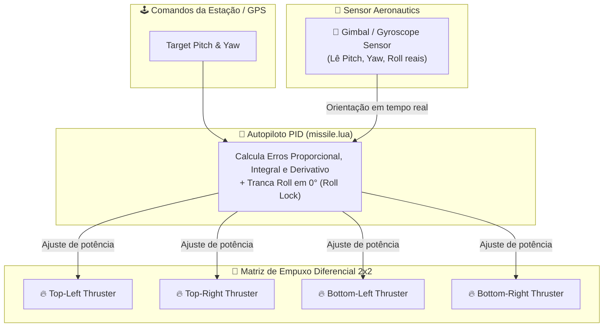

# 🔧 Guia de Montagem - Míssil Teleguiado (4 Thrusters 2x2 + Gimbal Aeronautics)

Guia passo-a-passo para construir o míssil com **4 Vector Thrusters em arranjo 2x2**, **Gimbal de Estabilização PID (Create Aeronautics)** e a estação de controle no Minecraft.

---

## 🚀 Parte 1: Construindo o Míssil (Arranjo 2x2 + Gimbal)

### Materiais Necessários

| Quantidade | Item | Mod |
|------------|------|-----|
| 1x | Advanced Computer | CC:Tweaked |
| 1x | Ender Modem (ou Wireless Modem) | CC:Tweaked |
| 1x | **Gimbal / Gyroscope / IMU** | Create Aeronautics |
| 4x | **Vector Thrusters** (Arranjo 2x2) | Create Propulsion |
| 1x | Solid Fuel Thruster (opcional, booster) | Create Propulsion |
| 1x | Physics Assembler | Create Simulated |
| ~20x | Blocos de estrutura (ferro, cobre, etc.) | Vanilla/Create |
| 1x | TNT ou Shell explosiva (opcional, ogiva) | Vanilla/CBC |
| 1x | Honey Glue (opcional, para manter junto) | Create Simulated |

---

### 📌 Arquitetura Visual dos 4 Thrusters 2x2 + Gimbal (ASCII)

```text
               [ VISTA FRONTAL / TRASEIRA DOS 4 THRUSTERS ]
               
                      +-------------------+-------------------+
                      |   🔥 THRUSTER TL  |   🔥 THRUSTER TR  |
                      | (Superior Esq.)   | (Superior Dir.)   |
                      |   Side: 'left'    |   Side: 'right'   |
                      +-------------------+-------------------+
                      |   🔥 THRUSTER BL  |   🔥 THRUSTER BR  |
                      | (Inferior Esq.)   | (Inferior Dir.)   |
                      |   Side: 'bottom'  |   Side: 'back'    |
                      +-------------------+-------------------+

                                    |
                           +-----------------+
                           | 🖥️ COMPUTER (PC) |  ← Cérebro (missile.lua)
                           | 🧭 [GIMBAL IMU] |  ← Giroscópio (Aeronautics)
                           | 📡 [ENDER MODEM]|  ← Conectado em uma lateral
                           +-----------------+
                                    |
                           +-----------------+
                           |   💥 OGIVA      |  ← TNT no lado 'top'
                           +-----------------+
```

---

### 📌 Diagrama de Voo com Estabilização PID Gimbal (Mermaid)



---

### Passo a Passo de Montagem

#### 1. Montando o Bloco 2x2 de Thrusters
1. Coloque **4 Vector Thrusters** juntos formando um quadrado **2x2** (2 de largura, 2 de altura).
2. Todos os bocais dos thrusters devem estar apontando para **trás** do míssil.

#### 2. Posicionando o Computador e o Gimbal
1. Coloque o **Advanced Computer** imediatamente à frente dos 4 Thrusters (no centro).
2. Coloque o **Gimbal / Gyroscope** do Create Aeronautics colado em qualquer face do computador.
3. Coloque o **Ender Modem** em outra lateral livre do computador e **clique com o botão direito** para ligar (luz vermelha acesa).

#### 3. Conexões de Redstone ou Wired Modems
Para o empuxo diferencial funcionar, cada um dos 4 thrusters deve receber o sinal de controle correspondente:
- **Superior Esquerdo (TL)**: Conectado ao lado `left` (esquerda) do computador.
- **Superior Direito (TR)**: Conectado ao lado `right` (direita) do computador.
- **Inferior Esquerdo (BL)**: Conectado ao lado `bottom` (baixo) do computador.
- **Inferior Direito (BR)**: Conectado ao lado `back` (trás) do computador.

#### 4. Conectando a Ogiva (TNT)
- Coloque a **TNT ou Ogiva** na face superior (`top`) do computador.

#### 5. Montando como Sub-Level de Física
1. Coloque o **Physics Assembler** adjacente à estrutura do míssil.
2. Use **Honey Glue** ou **Super Glue** para colar todos os blocos (Thrusters 2x2, Computador, Gimbal, Ogiva, Modem).
3. Ative o Physics Assembler com redstone para transformar o míssil numa entidade voadora de física com autopiloto ativado!

---

## 🎮 Parte 2: Estação de Controle

```text
   +-------------------------------------------------------+
   |             PAINEL DE MONITORES 3x2                   |
   |  +-----------------+-----------------+-------------+  |
   |  |  TELEMETRIA     |   BÚSSOLA / YAW |  STATUS GO  |  |
   |  +-----------------+-----------------+-------------+  |
   |  |  ALTITUDE / VEL |   PITCH / ROLL  |  OGIVA ARM  |  |
   |  +-----------------+-----------------+-------------+  |
   +-------------------------------------------------------+
                              |
                     +-----------------+
                     | 🖥️ COMPUTER (PC) |  ← Roda estacao.lua
                     | 📡 [ENDER MODEM]|  ← Comunicação Wireless
                     +-----------------+
```

1. Coloque os **6 Advanced Monitors** numa grade 3x2.
2. Conecte o **Advanced Computer** com o **Ender Modem**.
3. Baixe os scripts via terminal:
   ```bash
   wget run https://raw.githubusercontent.com/marcelin1555/MISSEL-FALAE/main/scripts/installer.lua estacao
   ```
4. Execute `reboot` e pilote seu míssil estabilizado por Gimbal PID!
